# Tarea 1
En esta tarea se realizaron diversos códigos en C++ para Arduino UNO, así, conociendo las funciones básicas que posee el microcontrolador por medio de circuitos simples que incluyen entradas y salidas, tanto físicas como analogas y digitales.

#  Arduino, ¿Qué es?

Arduino es software de código abierto con lnguaje C++, es un software libre y, además, tiene diferentes modelos de hard. Fue creado en italia en 2005 para desarrollar prototipos interactivos. Permite utlizar muchos microordenadores de una sola placa y darles muchos usos.

El hardware es una placa que contiene un microcontrolador principal que permite controlar sus elementos periféricos.

¿Cómo se utiliza el programa de Arduino IDE?

El Arduino IDE es el programa que se utiliza para escribir, revisar y cargar instrucciones en una placa Arduino. IDE significa Integrated Development Environment o “Entorno de Desarrollo Integrado”.

Primero se instala el Arduino IDE en la computadora y se conecta la placa Arduino mediante un cable USB. Dentro del programa se escribe el código, llamado sketch, usando un lenguaje basado en C/C++. Después, el IDE revisa si existen errores y compila el programa. Finalmente, al presionar el botón de cargar, el código se transfiere a la placa Arduino, que lo ejecuta para controlar componentes como luces, sensores, motores o pantallas.

Lista de materiales:

# Tarjeta Arduino:
Placa programable que controla el funcionamiento del proyecto mediante el código cargado desde la computadora.
# Cable USB-A a USB-B:
Se usa para conectar el Arduino UNO a la computadora, cargar los programas y, proporcionar alimentación eléctrica.
# Protoboard:
Tablero de pruebas que permite crear circuitos eléctricos con componentes.
# Jumpers:
Cables que pueden unir lineas de la protoboard, hacer saltos entre ellas y conectarse a los pines del Arduino UNO.
# LEDs:
Diodos emisores de luz empleados para simular  encendido y apagado.
# Botones:
Interruptores que permiten enviar una señal de entrada al Arduino cuando se presionan.
# Resistencias:
Componentes que limitan el paso de corriente y protegen elementos como LEDs, botones y circuitos.
# Display de 7 segmentos:
Dispositivo formado por siete LEDs que permite mostrar números del 0 al 9.
# Servomotores:
Motores que pueden girar a posiciones específicas y controladas por Arduino.
# Potenciómetros:
Resistencias variables que permiten modificar una señal eléctrica, por ejemplo para regular la intensidad de una luz o la posición de un servomotor.
# Fuente de poder:
Suministra la energía necesaria para alimentar el Arduino y los componentes del circuito.
# Push button (NC):
Botón que permite la .

## 00 Prueba parpadeo PIN 13 Arduino UNO
[Práctica_00](https://youtube.com/shorts/im3Q0wr0bbQ?feature=share)
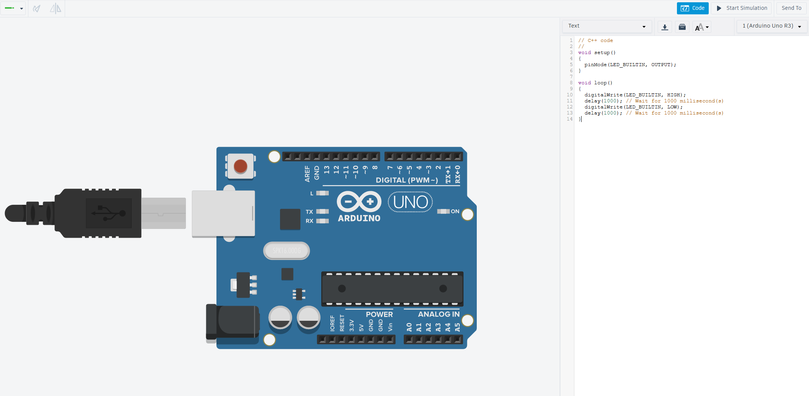
Esta práctica nos permite ver el Arduino inicializado, con la evidencia de que el indicador LED de entradas se encuentra parpadeando.

## 01 PIN_13_HIGH
[Práctica_01](https://youtube.com/shorts/f5nQAyJDfuA?feature=share)
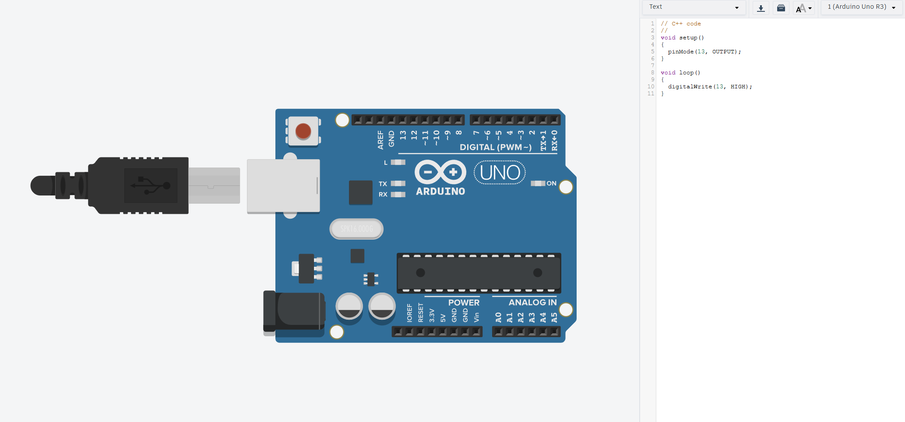

Aquí se configuró el indicador LED del arduino para que se mantenga encendido (HIGH).

## 02 PIN_13_LOW
[Práctica_02](https://youtube.com/shorts/JB2_dd-b4W0?feature=share)
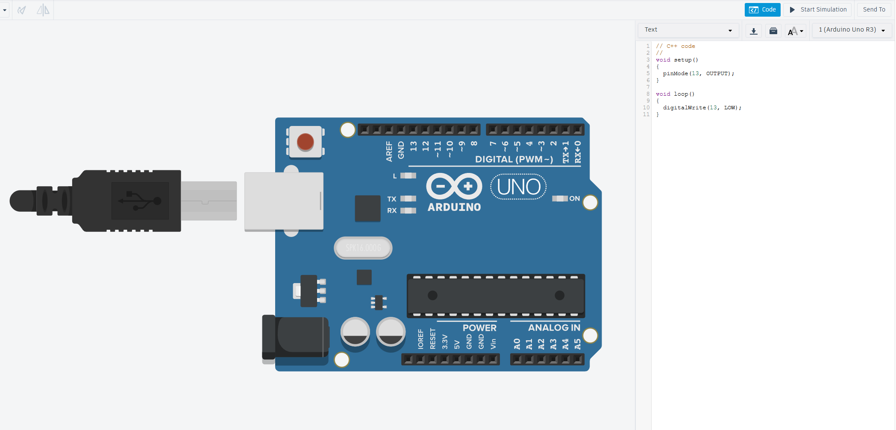

En ésta parte se configuró el indicador LED para que se mantuviera apagado (LOW).

## 03 Delay
[Práctica_03](https://youtube.com/shorts/T_IeBeGRtW0?feature=share)
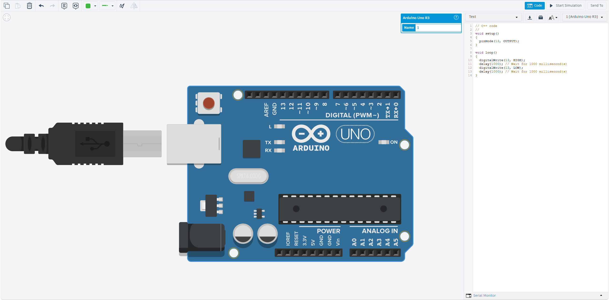

Aquí se programó el arduino para que el indicador LED tenga un retraso (delay) de 1 segundo.

## 04 Led parpadeando
[Práctica_04](https://youtube.com/shorts/o_R1jhTqSz4?feature=share)
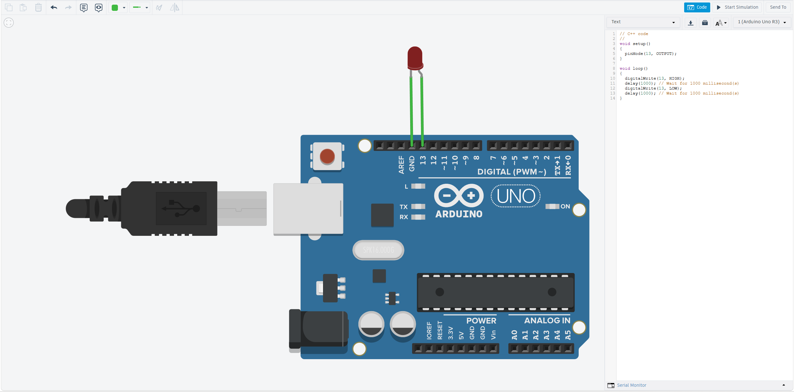

Se programó el arduino para que el LED se encendiera y se apagara al encontrarse conectado directamente al arduino.

## 05 Circuito con resistor para Led
[Práctica_05](https://youtube.com/shorts/GW0NLEjQkjs?feature=share)
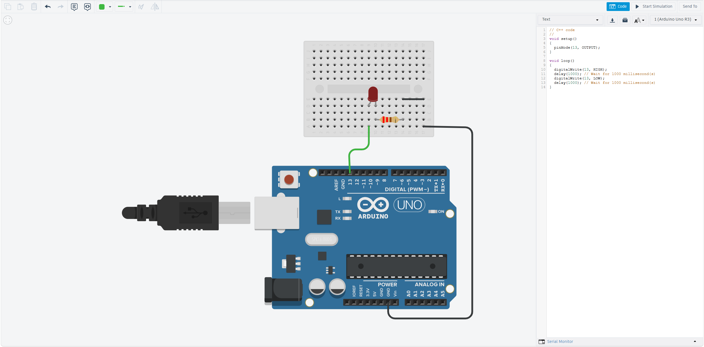

Se construyó un circuito con una resistencia de 220 ohmios para proteger al LED. A su vez, el código permitía que el LED parpadeara como en el ejercicio anterior.

## 06 Circuito con dos LEDs alternando
[Práctica_06](https://youtube.com/shorts/-ThP8Hp3MgQ?feature=share)

Se expandió el circuito existente añadiendo un LED y resistencia adicional en paralelo, y el código permitía que parpadearan intermitentemente uno tras otro.

## 07 Circuito con dos LEDs emparejados
[Práctica_07](https://youtube.com/shorts/CKdG0U9ygZA?feature=share)
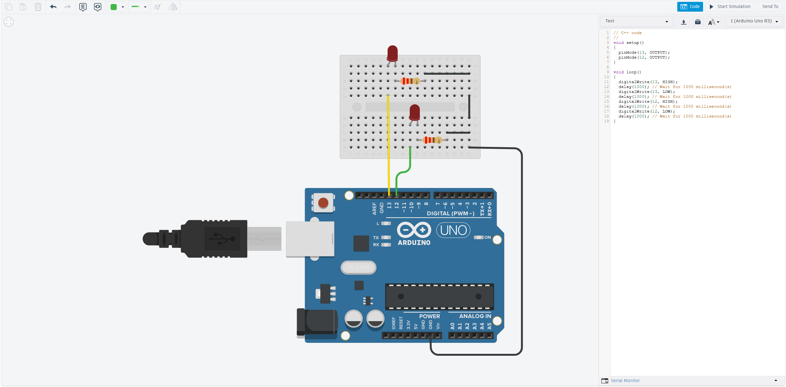

En escencia es el mismo circuito que el anterior, solo que el programa hace que los LEDs vayan a la misma frecuencia.

## 08 Display de 7 segmentos
[Práctica_08](https://youtube.com/shorts/yo0eoAQBA6g?feature=share)
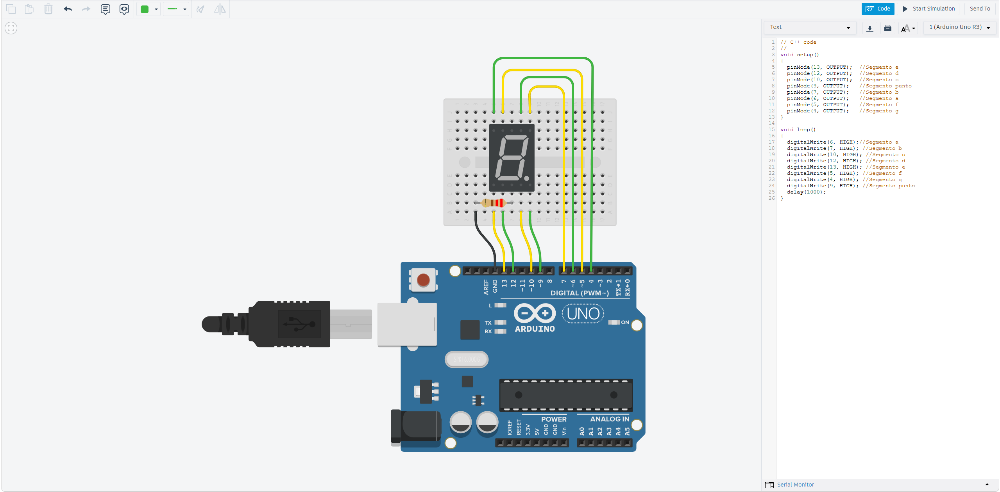

Se hicieron las conexiones correspondientes al display de 7 segmentos para que mostrara el número 9. Esto gracias a que el código mandaba señales HIGH y LOW a los pines correspondientes del display.

## 09 Contador
[Práctica_09](https://youtube.com/shorts/JFwFJl4hdnE?feature=share)
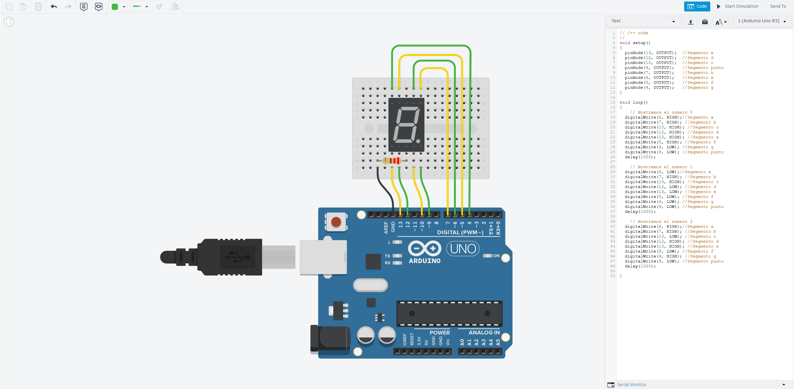

Se hizo un programa para realizar una secuencia númerica del 1 al 3 (no se hicieron bien las conexiones).

## 10 Entrada digital con botón
[Práctica_10](https://youtube.com/shorts/Obgd7tISlhM?feature=share)
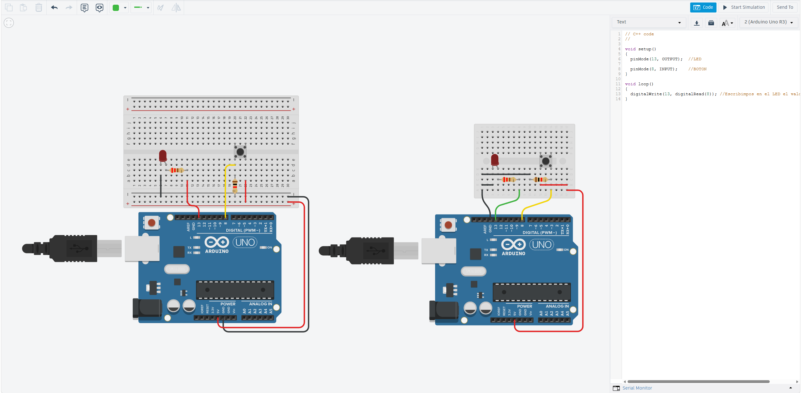

Construimos un circuito en el que un botón permitía el flujo de corriente a un LED, siendo el estado del botón la condición lógica.

## 11 Entrada digital con dos botónes
[Práctica_11](https://youtube.com/shorts/QLBKjJ9850g?feature=share)
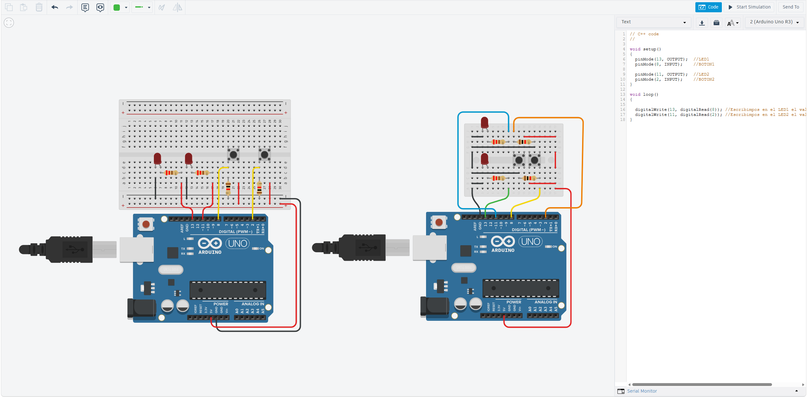

En escencia es la práctica anterior pero con dos botones.

## 12 Entrada digital con condición
[Práctica_12](https://youtube.com/shorts/SlA5CXg_wUw?feature=share)
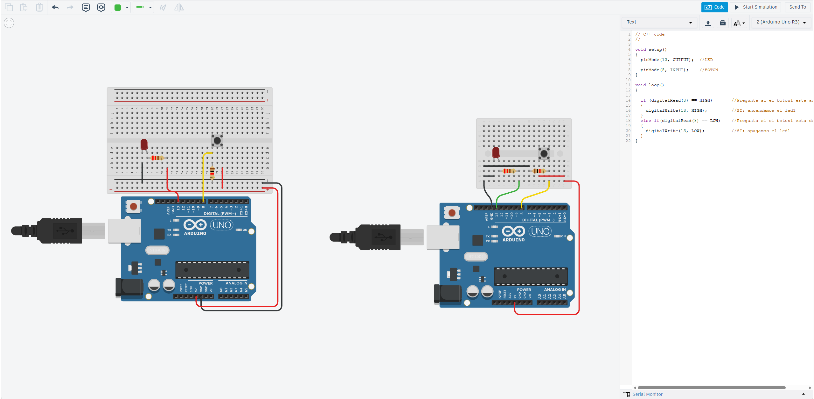

Lo que hace este código es leer el estado del botón, en este caso cuando se pulsa, el arduino lee que se cumple la condición y enciende el LED, cuando no se cumple lo apaga.

## 13 Entrada digital con condición (dos botones)
[Práctica_13](https://youtube.com/shorts/Z-R9o-GPFJ4?feature=share)
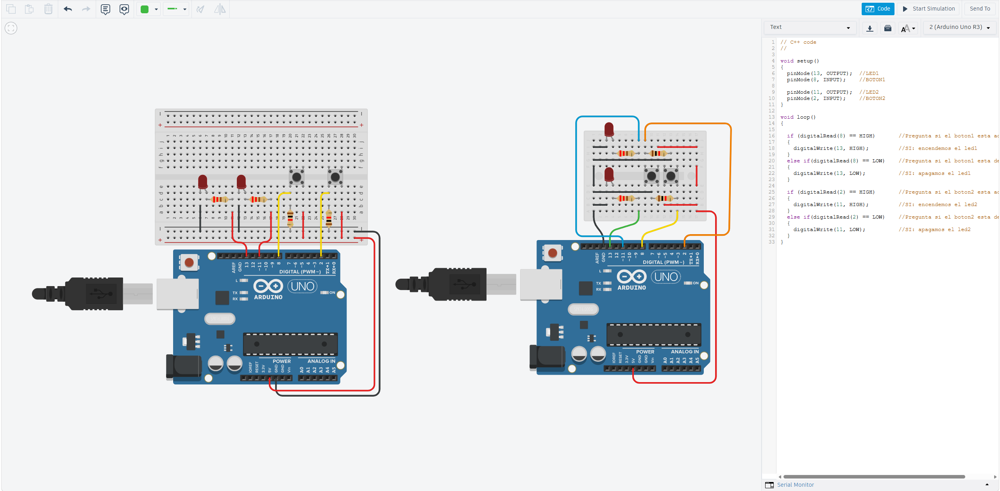

Hace exactamente lo mismo que la práctica anterior pero con dos botones.

## 14 Condición OR con botones
[Práctica_14](https://youtube.com/shorts/-T7_mfW067o?feature=share)
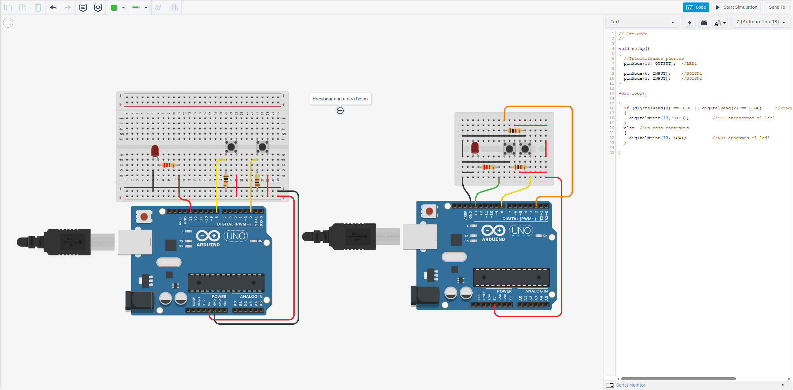

Se simuló una condición tipo OR en el código, haciendo que, si un botón **O** ambos estaban presionados, entonces el LED se encendía, si **ninguno** se encontraba presionado, entonces se apagaba.

## 15 Condición AND con botones
[Práctica_15](https://youtube.com/shorts/EIUdnmTyj9s?feature=share)

En este caso se simuló una compuerta tipo AND, siendo que la condición se cumple cuando **solo si** se presionan ambos botones..

## 16 Contador LED
[Práctica_16](https://youtube.com/shorts/u-XFvtNUUe0?feature=share)
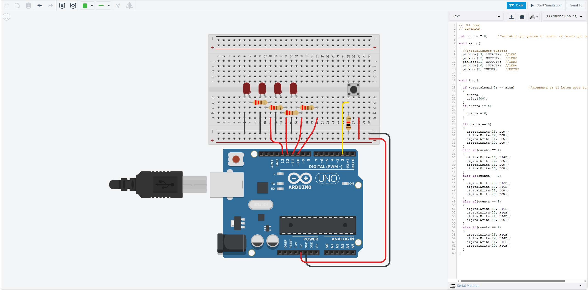

Se diseñó un circuito de LEDs en paralelo con la función de representar una cuenta, con un código que, por cada vez que se presionaba un botón, un LED adicional se iluminaba, y al llegar al máximo de LEDs iluminados, se reiniciaba la cuenta apagando todos los LEDs.

## 17 Inicio Servo
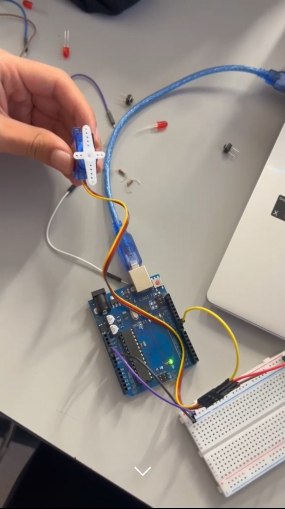
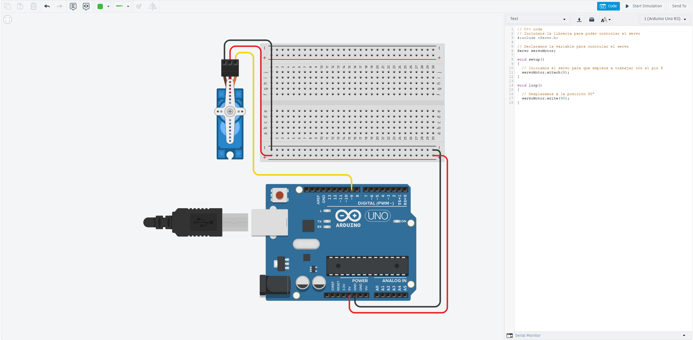

Este programa hacía que, al conectar un servomotor al arduino, hacía que este tomara el valor inicial de 0° sin importar su posición.

## 18 Posiciones Servo
[Práctica_18](https://youtube.com/shorts/r4xbcZfGzGU?feature=share)

Con este código, se creó una secuencia de posiciones en las que el servomotor se colocaba cada segundo. Dicha secuencia se repite indefinidamente.

## 19_1 Servomotor con potenciómetro
[Práctica_19_1](https://youtube.com/shorts/Fi9dAzrovCQ?feature=share)

Se diseñó un circuito que, dependiendo la corriente que permitiera pasar el potenciómetro, el servo tomaría valores de 0 a 180 grados. En el código se define una normalización de valores que se leen en la librería del servo de 0 a 5V.

## 20 Dos servomotores con potenciómetros
 *insertar vid Práctica_20*

Aquí, similar que en la práctica 19_1 se controlan dos servomotores utilizando potenciómetros.

[def]: assets