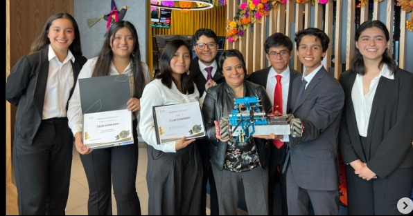

# Acerca de mí

Soy Leonardo García Gámez, una persona a la que le apasiona lo relacionado a la ingeniería, me fascinan los robots, los proyectos de innovación, las competencias donde este tipo de proyectos toman lugar, y me encanta poner a prueba mis capacidades y explotar mis ideas.

## Mi trayectoria

Desde el 2021 me he dedicado a la investigación de sistemas mecatrónicos y tecnologías para realizar proyectos innovadores y sustentables que ayuden a la sociedad, en paralelo, he participado en diversas competencias de robots y en eventos de apoyo social para personas de diversos sectores poblacionales.

Tuve la oportunidad de formar parte del Club de Robótica del CECyT 9, en el cual participé en las competencias realizadas por la empresa Make-X, en las categorías Starter y Challenge, donde, en la última, logré diseñar y contruir el robot que ganaría el primer lugar a nivel internacional en Abu Dhabi, Emiratos Arabes Unidos.

Participé en la versión de Tikkum Olam Makers 2023 en el colegio hebreo Olamí ORT, en el cuál, ayudamos a Ramsés, un niño con un parálisis nerviosa que era trasladado en una silla de ruedas convencional, la cual, se adaptó para que Ramsés tuviese menor incomodidad y le generase un mejor soporte para su cuerpo.

## Mis objetivos

Ser un igeniero mecatrónico que impulse la innovación, el desarrollo tecnológico, y la investigación en proyectos sustentables para crear un mañana con lleno de posibilidades y mejorar aspectos mencionados en los ODS de la ONU.

Conocer el mundo y viajar, atendiendo las necesidades de las personas que se encuentran con problemas, que no solamente requieran soluciones técnicas, también, soluciones más humanas. 

